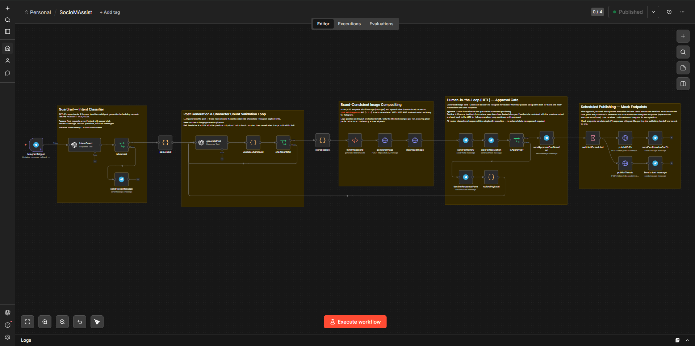

# SocioMAssist Bot

An AI-driven social media post automation system with human-in-the-loop approval, built entirely on n8n with Telegram as the user interface.

The system accepts post topics via Telegram, generates brand-aligned content and image cards using LLMs and an HTML-to-image API, pauses for human review, and publishes to mock social media endpoints at user-scheduled times.

## Demo Video

[](https://drive.google.com/file/d/1D3FTMrvZSdzc0-1bQIUB_Vl8BawUYKuG/view?usp=sharing)

## Architecture Overview

```
User (Telegram)
    │
    ▼
┌──────────────────────────────────────────────────────────────────────────┐
│  n8n Workflow (single execution per request)                            │
│                                                                         │
│  Telegram ─► Intent ─► Parse ─► LLM ─► Validate ─► Store ─► HTML ──►  │
│  Trigger     Guard     Input   (GPT)   Char Count   Session  Template  │
│                │                  ▲         │                     │      │
│                │                  └─────────┘                     ▼      │
│                │               (retry if >500 chars)         hcti.io    │
│                │                                             API call   │
│                │                                                │       │
│                │                                                ▼       │
│                │         ┌──────────── Download Image ◄─────────┘       │
│                │         │                                              │
│                │         ▼                                              │
│                │    Send Photo ─► Wait for ─► Approved? ──► Schedule    │
│                │    (Telegram)    Approval        │          & Publish   │
│                │                     ▲           │              │       │
│                │                     │        Declined          ▼       │
│                │                     │           │         Mock FB +    │
│                │                     │           ▼         Mock IG      │
│                │                     └── Feedback Form                  │
│                │                         + Retry LLM                    │
│                │                                                        │
│                ▼                                                        │
│           Reject Message (off-topic input)                              │
└──────────────────────────────────────────────────────────────────────────┘
```

## Tech Stack

| Component | Technology |
|---|---|
| Orchestration | n8n (cloud-hosted) |
| User Interface | Telegram Bot |
| Content Generation | OpenAI GPT-4o-mini |
| Intent Classification | OpenAI GPT-4.1-nano |
| Image Compositing | HTML/CSS + htmlcsstoimage.com API (hcti.io) |
| Mock Publishing | n8n Webhook workflows |
| Scheduling | n8n Wait node (time-based resume) |

## Repository Structure

```
socioMAssistbot/
├── README.md
├── SocioMAssist.json                ← here, not in workflow/
├── assets/
│   └── dope-01.png
├── docs/
│   └── prompts.md
├── scripts/
│   ├── card-template.html
│    └── code-nodes.js
└── License (Apache-2.0)

```
## How It Works

### 1. Input Ingestion

The user messages the Telegram bot with a topic and schedule time in natural language:

> "Write me a post about AI trends in healthcare. Schedule it for 25th June 10PM."

The bot accepts flexible input formats. The LLM handles datetime parsing and converts it to `YYYY-MM-DD HH:mm` format.

### 2. Intent Guard

Before reaching the content pipeline, every message passes through a lightweight intent classifier (GPT-4.1-nano). This returns a simple `{ "relevant": true/false }` using structured JSON output. Off-topic messages like "Hey whats up?" receive a polite rejection without consuming the main LLM's tokens.

### 3. Content Generation

GPT-4o-mini generates a structured JSON response containing a title (max 10 words), post copy (under 500 characters), and the parsed scheduled datetime.

**Prompt engineering strategy for length enforcement:**

The system uses a two-layer approach rather than relying solely on the LLM's self-counting ability:

**Layer 1 — Prompt-level guidance:** The system prompt specifies a target range of 350–480 characters with a hard cap at 500. Character count approximations (e.g., "350 chars ≈ 3–4 sentences") give the model a concrete sense of scale.

**Layer 2 — Programmatic validation:** A Code node measures the actual character count after generation. If the post exceeds 500 characters, the node constructs a feedback prompt containing the previous output and specific instructions to shorten it, then routes back to the LLM. This retry loop continues until the output passes validation. The constraint is enforced without truncation — the LLM always produces a naturally-worded post within limits.

### 4. Brand-Consistent Image Compositing

The image card is generated programmatically using an HTML/CSS template rendered via the htmlcsstoimage.com API (hcti.io). This guarantees structural consistency across every run.

**Technical pipeline:**

1. **HTML/CSS template** (`scripts/card-template.html`) defines the card layout at 1080×1080px with fixed positions:
   - Brand logo: `position: absolute; top: 56px; right: 56px` — never changes
   - Dynamic title: `position: absolute; bottom: 104px; left: 88px` — only text content changes
   - Background: dark gradient with subtle geometric accents pulled from the logo's rust/terracotta accent color (`#A0473A`)

2. **n8n HTML node** injects the LLM-generated title into the template via `{{$json.title}}`

3. **HTTP Request node** sends the populated HTML to `https://hcti.io/v1/image` with `viewport_width: 1080` and `viewport_height: 1080`

4. **Download node** fetches the rendered PNG as binary data for Telegram

**Pixel-perfect consistency is guaranteed because:**
- Logo placement is hardcoded in CSS (`top: 56px, right: 56px`) — it cannot drift
- Title position is locked to the bottom content block — only the text string changes
- A `card-wrapper` div with `overflow: hidden` clips all content to exactly 1080×1080px
- Font auto-scaling via JavaScript adjusts title size based on character count (84px default, scaling down to 56px for long titles) to prevent overflow

The logo PNG is hosted as a static asset on GitHub and referenced via raw URL, ensuring it loads reliably in the hcti.io rendering environment.

### 5. Human-in-the-Loop (HITL) Approval

The generated image card and post copy are sent to the user on Telegram for review. The workflow pauses and waits for a human decision before proceeding.

**Pausing and response mechanism:**

The HITL gate uses two consecutive Telegram nodes:

1. **Send Photo node:** Sends the rendered card image as a binary attachment with a formatted caption containing the title, post copy, scheduled time, and character count.

2. **"Send and Wait for Approval" node:** Immediately follows with Approve/Decline buttons. This uses n8n's built-in webhook-based approval mechanism — when the user taps a button, it hits n8n's own resume URL directly (not the Telegram Trigger webhook), so the paused execution resumes without spawning a new one.

**On Approve:** The workflow continues to the scheduling and publishing phase.

**On Decline:** A feedback form opens where the user describes desired changes. The feedback is combined with the previous LLM output in the `reviewPayLoad` Code node and fed back to `generatePost` for a full revision cycle. The review loop continues until the user approves.

All interactions within a review cycle happen inside a single n8n execution — no external state management, databases, or session storage is required.

### 6. Scheduled Publishing

Upon approval, the workflow queues the post for the user's specified datetime:

1. **Wait node** (configured to resume at the `scheduled_at` datetime) pauses the execution
2. At the scheduled time, two parallel **HTTP Request nodes** POST the content to mock Facebook and Instagram endpoints
3. The mock endpoints are separate n8n webhook workflows that simulate real API responses with generated post IDs
4. **Telegram confirmation messages** notify the user that publishing is complete on each platform

## Setup & Reproduction

### Prerequisites

- n8n instance (cloud or self-hosted)
- Telegram Bot (created via @BotFather)
- OpenAI API key
- htmlcsstoimage.com account (free tier: 50 images/month)

### Steps

1. **Import the workflow:** In n8n, go to Settings → Import Workflow → upload `workflow/SocioMAssist.json`

2. **Configure credentials in n8n:**
   - Telegram Bot API token
   - OpenAI API key
   - hcti.io Basic Auth (user_id as username, api_key as password)

3. **Set up mock endpoint workflows:** Create two simple n8n workflows with Webhook Trigger nodes at paths `/mock-facebook-publish` and `/mock-instagram-publish`. Each should return a 200 response with a mock `post_id`.

4. **Register Telegram webhook:**
   ```
   curl "https://api.telegram.org/bot<TOKEN>/setWebhook?url=<N8N_WEBHOOK_URL>"
   ```

5. **Activate the workflow** and message the bot.

## Workflow Nodes Summary

| Node | Type | Purpose |
|---|---|---|
| telegramTrigger | Telegram Trigger | Receives all incoming messages |
| intentGuard | OpenAI (GPT-4.1-nano) | Classifies intent as relevant/irrelevant |
| isRelevant | IF | Routes valid requests vs rejections |
| sendRejectMessage | Telegram | Polite rejection for off-topic input |
| parseInput | Code | Normalizes input to `{ text, chat_id }` |
| generatePost | OpenAI (GPT-4o-mini) | Generates title + post + scheduled_at |
| validateCharCount | Code | Enforces 500 char limit with retry loop |
| charCountOk? | IF | Routes valid output vs retry |
| storeSession | Code | Centralizes validated data |
| htmlImageCard | HTML | Brand template with injected title |
| generateImage | HTTP Request | POSTs HTML to hcti.io API |
| downloadImage | HTTP Request | Downloads rendered PNG as binary |
| sendForReview | Telegram | Sends card image + caption |
| waitForUserAction | Telegram | Approve/Decline buttons (pauses execution) |
| isApproved? | IF | Routes approve vs decline |
| sendApprovalConfirmation | Telegram | Confirms approval to user |
| declineResponseForm | Telegram | Free-text feedback form |
| reviewPayLoad | Code | Combines feedback + previous output for LLM retry |
| waitUntilScheduled | Wait | Pauses until scheduled datetime |
| publishToFb | HTTP Request | POSTs to mock Facebook endpoint |
| publishToInsta | HTTP Request | POSTs to mock Instagram endpoint |
| sendConfirmationForFb | Telegram | Facebook publish confirmation |
| Send a text message | Telegram | Instagram publish confirmation |

## License

This project is licensed under the Apache-2.0 License — see the [LICENSE](LICENSE) file for details.
